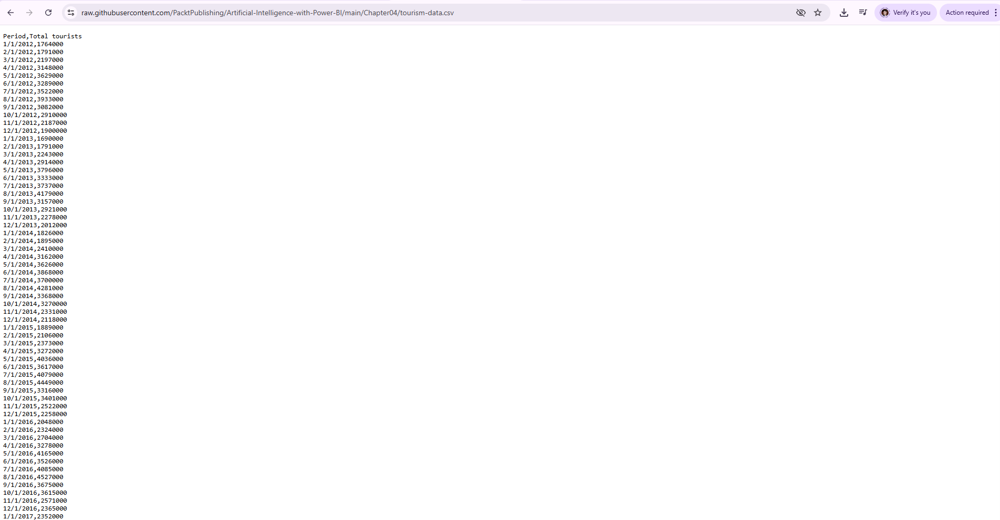
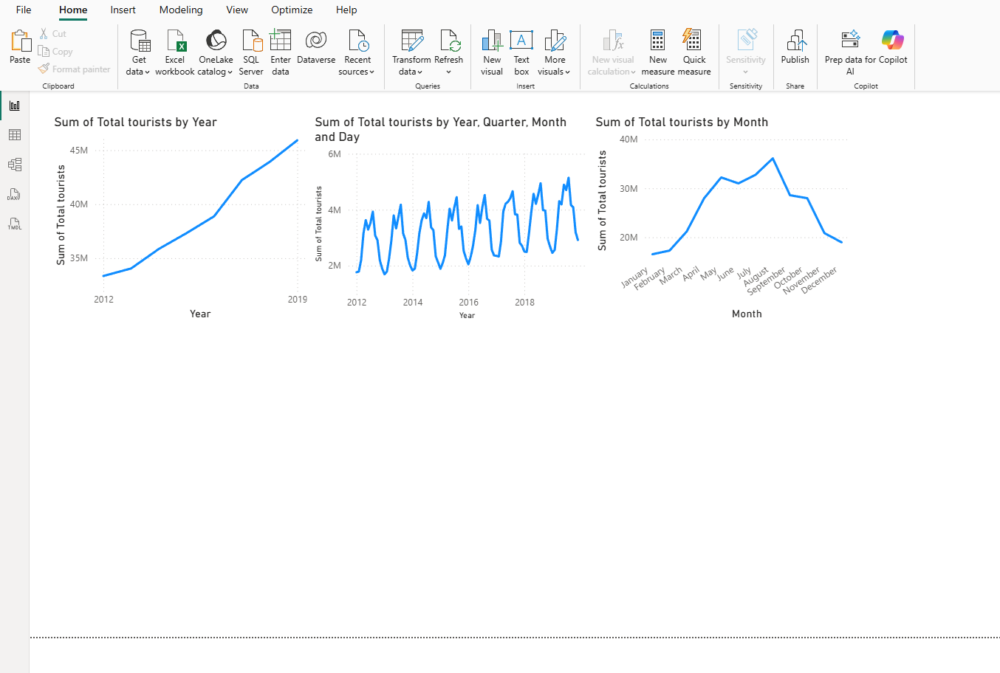
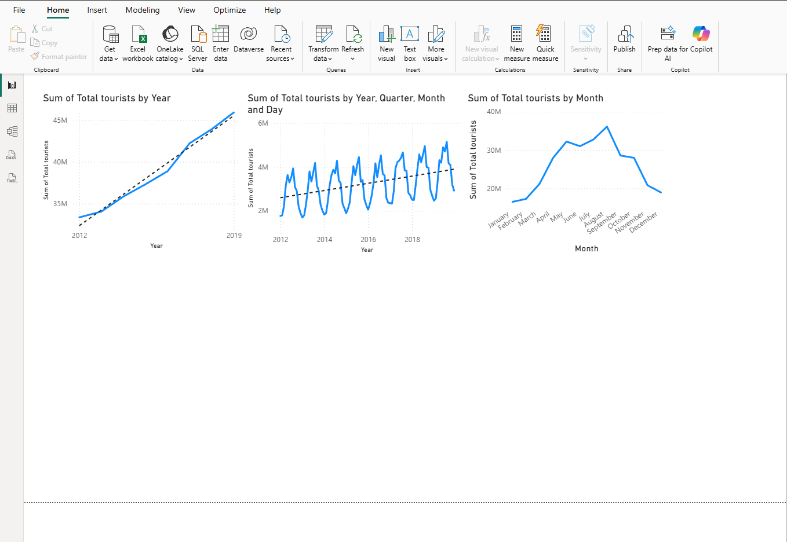
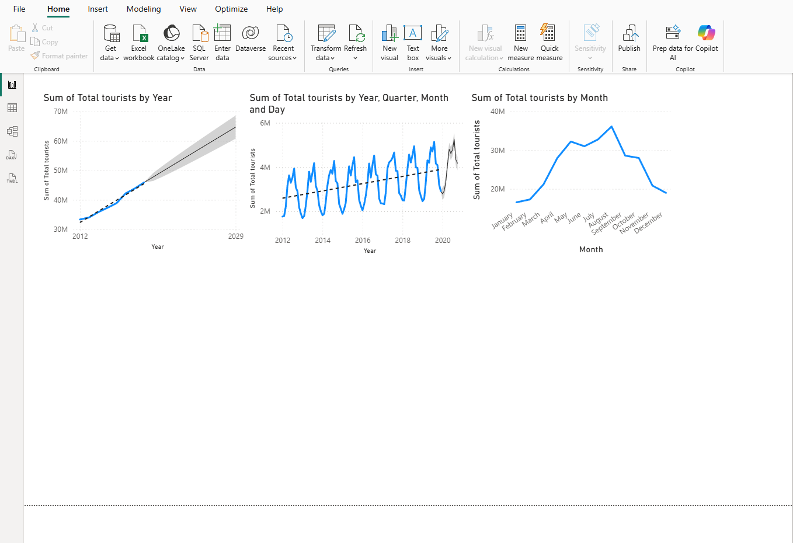

<h1 align="center">Laboratory Work 4 Activity | Forecasting</h1>
<h3 align="center">Time-Series Data in Power BI</h3>

<h3>My PowerBI File</h3>
<a href="https://drive.google.com/file/d/16ki4pJyWzB9TzMqWcoRiX8W1mYtTavvN/view?usp=sharing">Click here</a>
<h3>My new 50 rows dataset</h3>
<a href="https://drive.google.com/file/d/17Tuu7ntBcs6wOc3pumMw6fqCk2wnOJ7m/view?usp=sharing">Click here</a>

<h2>📌 Objective</h2>

To understand and apply the forecasting capabilities of Power BI using time-series data
by first replicating the tourism dataset activity and then extending the learning using a
modified dataset with disruptions or additional data points. This follows the required
objective of the laboratory activity. 

<h2>🛠️ Prerequisites</h2>
<ul>
  <li>Power BI Desktop installed</li>
  <li>Basic familiarity with importing data and creating visuals in Power BI</li>
  <li>Internet access for downloading the sample dataset</li>
</ul>

<h2>📂 Materials Used</h2>
<ul>
  <li><b>Original Dataset:</b> <code>tourism-data.csv</code></li>
  <li><b>Modified Dataset:</b> <code>tourism_dataset_50_rows.csv</code> (or your Part 2 dataset filename)</li>
  <li><b>Power BI File:</b> <code>monte_IS107_LW4.pbix</code></li>
</ul>

<h2>📖 Part 1: Replicating the Tourism Data Forecast</h2>

  

<h3>Step 1: Download the Sample Dataset</h3>

The sample tourism dataset was downloaded from the GitHub link provided in the activity instructions.
The dataset file used was <code>tourism-data.csv</code>.

<h3>Step 2: Import Data into Power BI</h3>

The dataset was imported into Power BI Desktop using <b>Home → Get Data → Text/CSV</b>.
The preview was checked to ensure the data loaded correctly before clicking <b>Load</b>.

<h3>Step 3: Create a Line Chart for Yearly Data</h3>

  

A <b>Line Chart</b> was created in the report canvas. The following fields were assigned:

<ul>
  <li><b>Axis:</b> Period</li>
  <li><b>Values:</b> Total tourists</li>
</ul>

The date hierarchy was adjusted so that only the <b>Year</b> level was used in the visualization.

<h3>Step 4: Add a Trend Line</h3>

  

With the line chart selected, the <b>Analytics</b> pane was opened and a <b>Trend line</b> was added.
This made it easier to observe the general direction of tourist activity over time.

<h3>Step 5: Add Forecasting</h3>

  

Forecasting was added from the <b>Analytics</b> pane of the line chart. A forecast line appeared on the chart,
allowing future values to be predicted based on the historical pattern of the data.

<h3>Step 6: Configure the Forecast</h3>

The forecast settings used for Part 1 were:

<ul>
  <li><b>Forecast length:</b> 12 points</li>
  <li><b>Ignore last:</b> 0 points</li>
  <li><b>Confidence interval:</b> 95%</li>
  <li><b>Seasonality:</b> 12 points</li>
</ul>

<h3>Step 7: Analyze the Forecast</h3>

The forecast generated by Power BI for the next period was analyzed based on the trend line and confidence interval.
A relatively narrow confidence interval suggests that the forecast is more stable and consistent for the observed pattern,
while a wider interval suggests greater uncertainty.

<h3>📝 Analysis for Part 1</h3>

The tourism dataset showed a time-based pattern that Power BI was able to model using its built-in forecasting feature.
The line chart indicated the historical trend of tourist values, while the forecast line projected future values.
The confidence interval provided a visual estimate of certainty, where a narrower shaded region implied more reliable predictions
for the given data pattern.

<h2>📖 Part 2: Enhancement - Forecasting with Imperfect Data</h2>

<h3>Step 8: Prepare a New Dataset</h3>

For the second part of the activity, a modified version of the tourism dataset was prepared.
This dataset included additional data points and simulated disruptions to make the data more realistic and imperfect,
as required by the activity. The modified dataset contained <b>50 new rows</b>.

<h3>Step 9: Import and Prepare the New Dataset</h3>

The new dataset was imported into Power BI using <b>Get Data → Text/CSV</b>. In the Power Query Editor,
the following checks were performed:

<ul>
  <li>Date column was confirmed as <b>Date</b> type</li>
  <li>Numerical values were confirmed as <b>Whole Number</b> or <b>Decimal Number</b></li>
  <li>Any missing or problematic values were reviewed and handled if needed</li>
</ul>

<h3>Step 10: Create a Line Chart for the New Data</h3>

A new line chart was created using the time field as the <b>Axis</b> and the target numerical value as the <b>Values</b>.
The appropriate time hierarchy was chosen depending on the granularity of the data.

<h3>Step 11: Add and Configure the Forecast</h3>

The forecast feature was applied again in the Analytics pane. Different settings were tested to observe how the visualization changed.
The following experiments were performed:

<ul>
  <li><b>Forecast length:</b> 12 points / 24 points</li>
  <li><b>Ignore last:</b> 0, 3, and 6 points</li>
  <li><b>Confidence interval:</b> 90%, 95%, and 99%</li>
  <li><b>Seasonality:</b> Auto or manually configured depending on the data pattern</li>
</ul>

<h3>Step 12: Analyze and Report Findings</h3>

<h4>1. Dataset Description</h4>

The dataset used in Part 2 was a modified tourism dataset. It was based on the original tourism time-series data
but was enhanced by adding 50 new data rows and introducing small disruptions to simulate imperfect real-world data.
The covered time period depends on the final date range of the modified dataset.

<h4>2. Forecast Visualization</h4>

  

<h4>3. Interpretation of Forecast</h4>

The modified dataset showed a more varied pattern compared to the original dataset. This affected the forecast because Power BI
had to account for fluctuations and irregularities in the data. The confidence interval became an important indicator of reliability.
If the shaded area was narrow, the model appeared more confident; if it widened, the forecast indicated increased uncertainty.

Changing the <b>Ignore last</b> setting allowed comparison between forecasting with all available data and forecasting while excluding
the most recent data points. This helped show how sensitive the forecast was to recent changes. Changing the <b>Confidence interval</b>
also affected the width of the shaded forecast region: lower confidence levels produced narrower bands, while higher confidence levels
produced wider bands.

For the disruptions added to the dataset, the forecast generally followed the broader pattern of the data rather than precisely predicting
each sudden irregularity. In some cases, the confidence interval widened, indicating that the presence of disruptions reduced certainty
in the prediction.

<h4>4. Conclusion</h4>

Power BI's forecasting feature is useful for identifying future trends in time-series data, especially when the data has a clear
historical pattern and seasonality. Its strengths include ease of use, quick visualization, and adjustable forecasting settings.
However, its limitations become more noticeable when the dataset contains disruptions, irregular spikes, or missing values,
because these can reduce forecast reliability and widen the confidence interval.

<h2>📊 Summary of Findings</h2>
<table>
  <tr>
    <th>Part</th>
    <th>Dataset Used</th>
    <th>Main Task</th>
    <th>Key Observation</th>
  </tr>
  <tr>
    <td>Part 1</td>
    <td>Original tourism-data.csv</td>
    <td>Replicate tourism forecast</td>
    <td>Clear trend and forecast with interpretable confidence interval</td>
  </tr>
  <tr>
    <td>Part 2</td>
    <td>Modified tourism dataset with 50 new rows</td>
    <td>Forecast with imperfect data</td>
    <td>Forecast became more sensitive to disruptions and uncertainty increased</td>
  </tr>
</table>

<h2>✅ Notes</h2>
<ul>
  <li>Replace all placeholder names with your actual details.</li>
  <li>Update the screenshot file names if your actual image names are different.</li>
  <li>Make sure your <code>.pbix</code> file and datasets are included in the repository if required by your instructor.</li>
</ul>

  <i>Submitted in partial fulfillment of the requirements for Laboratory Work 4 Activity | Forecasting</i>

